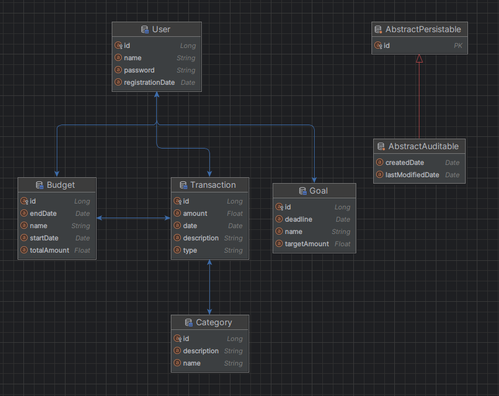

# ER - диаграмма

## Реализация метода поиска сущности по полям
В репозитории `TransactionRepository` реализован метод `getTransactionsByDateAndUser` поиска сущностей по их полям с использованием Query Lookup Strategies. В названии метода используются ключевые слова Spring, такие как `And`.

## Реализация метода поиска сущности по полям

В репозитории `TransactionRepository` реализован метод `getTransactionsByCategory` поиска транзакций по категории с использованием языка JPQL и аннотации @Query.

## Реализация запросов с использованием Criteria API

Пример использования Criteria API:

1. Метод поиска транзакций по дате и пользователю.
2. Метод поиска транзакций по категории.

Эти методы находятся в интерфейсе CustomTransactionRepository и реализованы в классе CustomTransactionRepositoryImpl.

## Реализация транзакционной операции

В проекте выбраны две сущности, между которыми существует логическая связь: `Transaction` и `Category`. Реализован транзакционный метод `deleteCategory` в `CategoryServiceImpl`, обеспечивающий целостность данных при работе с этими сущностями. Транзакционность обеспечивается с использованием механизма TransactionManager.

## Тестирование

Для всех перечисленных классов и методов, реализованы соответствующие им, тестовые классы.